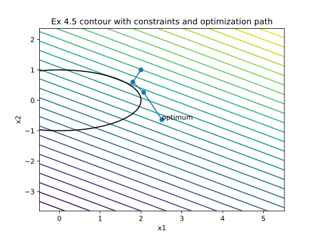

### 4.4

I was not able to implement a working Quasi-Newton SQP algorithm, it would get stuck after a couple of iterations, even though the first iteration hessian and lambdas matched example 5.12 exactly.

here is the optimization path for Example 5.4

