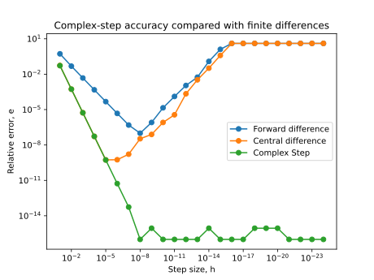

# AE588 Assignment 5 - akshatdy

## 5.1.a

- Do you get any complex-step derivatives with zero error compared to the analytic reference?

  - Yes I do, and those are artificially replaced with 1e-16 to get a nicer looking plot that is continuous

- What is the smallest step you can use before you get underflow?

  - The smallest step I can use is 1e-323, after that I get a "invalid value encountered in scalar divide" when the functions try to divide by the step size, and for step sizes smaller than that, the output is nan
  - The point at which different algorithms are affected by underflow are:
    - Forward difference: 1e-15
    - Central difference: 1e-15
    - Complex step: It doesnt underflow in the sense that the derivative doesnt go to 0, but it starts deviating from the actual gradient at 1e-308

- What does that mean, and how should you show those points on the plot?

  - For finite difference, this means that the subtractive cancellation makes the difference = 0 which causes the overall gradient to reduce to 0
  - For central difference, this means that the division encounters a 0 and gets a nan as a result of the computation
  - When plotting the errors of the derivatives
    - Top end: Plotting in log ensures that large values generated by very small step sizes for forward and central finite difference do not obscure our view of the smallers errors generated by larger step sizes
    - Bottom end: Reassigning all the 0 errors of complex step to a value of 1e-16 makes the graph continuous and easier to read as well

- Estimate the value of h required to eliminate truncation error in derivative using the equations in the textbook.
  - From the textbook, the optimal step size for the forward finite difference is approximately $\sqrt{\epsilon_f}$ , where $\epsilon_f$ is the precision of $f$, and for the central difference, the optimal step size scales approximately with $\sqrt[3]{\epsilon_f}$
  - Precision of $f$ can be found with the `math.ulp()` function, so the optimal $h$ is:
    - Forward difference: 2.9802322387695312e-08
    - Central difference: 9.61243476787471e-06
- Is this estimate consistent with your plot?
  - Yes this estimate is consistent with the plot

## 5.1.b

The AD implementation consists of new functions for all the operators required in the given problem. All these functions take in a new data type, that consists of the value and a derivative. The derivative is initialized to 1 so that subsequent operations with the data can utilize the chain rule effectively.
The problem equation is then re-written using the the AD operators and we get the value and derivative when we evaluate the problem function directly.

Using AD, at x = 1.5, fx = 4.497780053946162, dx = 4.053427893898621

The derivative matches what I get from the complex step method, the difference is 0
