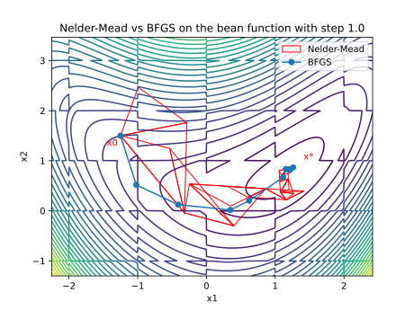

## 6.2

General notes:

- In my implementation of Nelder-Mead, I have adjusted the maximum iterations allowable to ensure that the optimizer always exits only when convergence critera for $\Delta_f$ and $\Delta_x$ are met.
- The convergence criteria for SciPy based optimizers have been left at their defaults.
- When using a gradient based method, I provide the function and gradient separately to SciPy. Hence, when calculating the total function calls (fev), I have added both the function and jacobian evaluations for the SciPy BFGS cases with analytical gradients.

### 6.2.a

Results for my Nelder-Mead implementation:

| fev | $x^*$                              | $f(x)^*$        |
| --- | ---------------------------------- | --------------- |
| 118 | [ 1.2134114738702 0.8241223344287] | 0.0919438164113 |

\pagebreak

### 6.2.b

Results comparing the optimization of a noisy bean function between:

- my implementation of Nelder-Mead
  - This was given enough iterations so that it never stops unless the other convergence critera are met
- Scipy BFGS and analytical gradient that is consistent with the noisy bean function
  - left at default settings so it may stop without meeting convergence criteria
  - function evaluations and jacobian evaluations are added to get a full picture of the total "function" calls since those are provided separately

The noise was varied from $10^{-1}$ to $10^{-9}$, but only certain important results are displayed here so the table can look nice

The results in the table are based on the difference between

- a baseline optimum given by BFGS with analytical gradients on smooth bean
- the optimum given by Nelder-Mead and BFGS on a noisy bean

The noise as asked in the question has been bolded for visibility

| noise         | 1e-09            | 1e-07            | **1e-04**            | 1e-03            | 1e-01            |
| ------------- | ---------------- | ---------------- | -------------------- | ---------------- | ---------------- |
| NM $x^*_1$    | 2.0163130543e-07 | 1.7823436629e-06 | **1.1398095279e-03** | 1.1137357362e-02 | 1.4233977454e-01 |
| BFGS $x^*_1$  | 2.1221663982e-08 | 1.7827848480e-06 | **1.1387659005e-03** | 1.1137250698e-02 | 3.0250005917e-01 |
| NM $x^*_2$    | 1.0921469717e-07 | 3.1169619389e-06 | **3.2864916927e-04** | 1.3311632814e-02 | 2.1351179809e-01 |
| BFGS $x^*_2$  | 3.0562184006e-08 | 3.0765705131e-06 | **3.2676560626e-04** | 1.3310648521e-02 | 4.3373146544e-01 |
| NM $f(x)^*$   | 8.9171718620e-10 | 6.0122489765e-08 | **1.0421326057e-04** | 1.2019839886e-04 | 3.4746256407e-02 |
| BFGS $f(x)^*$ | 8.9175596074e-10 | 6.0122437681e-08 | **1.0421325524e-04** | 1.2019881706e-04 | 1.2929027499e-01 |
| NM fev        | 118              | 116              | **119**              | 152              | 165              |
| BFGS fev      | 22               | 22               | **24**               | 128              | 260              |

We can see that in most cases with low noise, BFGS beats or matches the precision of Nelder-Mead, with fewer function evaluations. However, as the noise increases, around $10^{-3}$, BFGS starts to struggle, with more function evaluations than Nelder-Mead. Eventually at $10^{-1}$, the result from BFGS is a lot worse than the result from Nelder-Mead with more function evaluations.

This might happen because as the noise increases, the gradient that BFGS uses gets more and more affected by the noise as it starts to converge towards the minimum, and is unable to proceed in the correct direction.

This behaviour can be seen if we trace the optimization path of Nelder-Mead with BFGS at an acceptable noise level, like $10^{-4}$ and again at $10^{-3}$, where you can see that it starts zig-zagging a lot more towards the end trying to find the optimum

{ width=550px }

{ width=550px }

From this, we can conclude that Nelder-Mead is better suited to situations where the noise is quite high proportional to the function and gradient value near the optimum.

\pagebreak

### 6.2.c

Results comparing the optimization of a bean function with checkerboard steps between:

- my implementation of Nelder-Mead
  - This was given enough iterations so that it never stops unless the other convergence critera are met
- Scipy BFGS and analytical gradient that is **same as** the smooth bean function
  - left at default settings so it may stop without meeting convergence criteria
  - function evaluations and jacobian evaluations are added to get a full picture of the total "function" calls since those are provided separately

The step was varied from 5 - 4.5 in steps of 0.5, but only certain important results are displayed here so the table can look nice

The results in the table are based on the difference between

- a baseline optimum given by BFGS with analytical gradients on smooth bean
- the optimum given by Nelder-Mead and BFGS on a bean with checkerboard steps

The step as mentioned in the book has been bolded for visibility

| step          | 0.5              | 1                | 2                | **4**                |
| ------------- | ---------------- | ---------------- | ---------------- | -------------------- |
| NM $x^*_1$    | 1.9525311101e-07 | 3.7481327375e-08 | 5.3108398495e-01 | **5.3108513572e-01** |
| BFGS $x^*_1$  | 5.2850222865e-08 | 1.4886810451e-08 | 9.6900960373e-01 | **2.4245849311e+00** |
| NM $x^*_2$    | 5.3761213215e-07 | 5.8140068204e-08 | 8.2412244364e-01 | **8.2412244364e-01** |
| BFGS $x^*_2$  | 3.5659314945e-08 | 2.2196733696e-07 | 8.3577030009e-01 | **5.0985975251e-01** |
| NM $f(x)^*$   | 8.2503448517e-14 | 3.4486302702e-14 | 1.1173500938e+00 | **1.1173500938e+00** |
| BFGS $f(x)^*$ | 1.5626389072e-14 | 1.0322298571e-13 | 1.5058626297e+00 | **5.6301164658e+00** |
| NM fev        | 114              | 123              | 231              | **266**              |
| BFGS fev      | 24               | 24               | 144              | **125**              |
| BFGS conv     | True             | True             | False            | **False**            |

We can see that in cases with a large step like 4, Nelder-Mead beats the precision of BFGS by a huge margin. However, as the step decreases, around 1 and 2, BFGS becomes comparable. Eventually at 0.5, the result from BFGS is better than the result from Nelder-Mead. Throughout all step sizes, BFGS consistently has fewer function evaluations than Nelder-Mead, however the function calls rise sharply for sizes 2 and 4.

This might happen because as the step size increases, the line search that BFGS uses has a higher chance of getting confused by the step if the function value after the step is a lot higher than before it. This might cause BFGS to get stuck and not be able to converge. This can be seen in the status of the result returned by the SciPy optimizer, as it is not able to converge for step sizes 2 and 4.

This behaviour can be seen if we trace the optimization path of Nelder-Mead with BFGS at all the step sizes, where you can see that it starts getting stuck near the checkerboard edges as the step size increases, and is not able to even proceed beyond the first few iterations for a step size of 4.

{ width=375px }
{ width=375px }

{ width=375px }
{ width=375px }

From this, we can conclude that Nelder-Mead is better suited to situations where the the function is extremely discontinuous.

\pagebreak

### 6.2.d

The same function was optimized with both BFGS and Nelder-Mead

| Method | conv  | fev | $x^*$                                 | $f(x)^*$    |
| ------ | ----- | --- | ------------------------------------- | ----------- |
| NM     | True  | 319 | -1.17968e-12 8.52064e-13 1.47292e-07  | 2.90550e-12 |
| BFGS   | False | 112 | -4.21251e-01 2.54760e-02 -1.46982e-02 | 4.72419e-01 |

Nelder-mead works beautifully here, as opposed to BFGS. We can see that BFGS failed to converge, as seen by the "conv" column. This makes sense, as the optimim point is at [0,0,0], where the gradient is undefined due to the absolute value in the function, and causes a divide by 0 for BFGS. This makes the problem ill-conditioned and prevents BFGS from getting close to the optimum and fail to converge.

From this, we can conclude that Nelder-Mead is better suited to situations where the function has a discontinuous gradient, and is not C2 continuous, which is a requirement for BFGS. If we want to make it work with BFGS, we will have to modify the function to be continuous near the optimum, using methods similar to Kreisselmeier–Steinhauser (KS) aggregation for constrained optimization.
