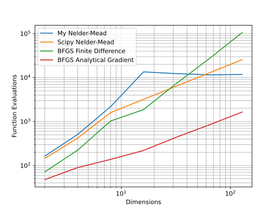

## 6.3

General Notes:

- When using BFGS with analytical gradient, I provide the function and gradient separately to SciPy. Hence, when calculating the total function calls (fev), I have added both the function and jacobian evaluations.
- My implementation of Nelder-Mead has an iteration limit of 10000, which ends up being ~12000 to ~13000 function evaluations, after which it reports that it failed to converge.
- The value of $x$ mentioned in the table is the norm of (x returned - optimal x[1, 1, ...]) so that higher dimensions can be reasonably compared.
  - **Note:** This same subtraction is not needed for $f(x)$ since the optimal value is just 0.

n=128 is the highest number I was able to reasonably manage. The results for n=[2, 4, 8, 16, 32, 64, 128] for all the methods are in the table.

**Note: In my python code, I have limited the dimensions to 64 so that it doesnt time out the autograder**

| dims            | 2         | 4         | 8         | 16        | 32        | 64        | 128       |
| --------------- | --------- | --------- | --------- | --------- | --------- | --------- | --------- |
| NM $x$          | 2.736e-07 | 3.181e-07 | 4.253e-08 | 3.461e+00 | 5.100e+00 | 7.670e+00 | 1.119e+01 |
| SciPy NM $x$    | 1.151e-05 | 2.855e-05 | 1.156e+00 | 3.966e+00 | 5.547e+00 | 7.942e+00 | 1.129e+01 |
| BFGS FD $x$     | 1.193e-05 | 1.376e-05 | 1.515e-05 | 1.543e-05 | 1.552e-05 | 1.547e-05 | 1.560e-05 |
| BFGS AG $x$     | 1.951e-06 | 3.398e-09 | 3.844e-08 | 1.211e-07 | 1.923e-08 | 9.878e-08 | 2.930e-08 |
| NM $f(x)$       | 2.724e-14 | 4.136e-14 | 6.693e-14 | 1.115e+01 | 2.556e+01 | 5.868e+01 | 1.255e+02 |
| SciPy NM $f(x)$ | 3.686e-10 | 5.808e-10 | 6.150e-01 | 1.487e+01 | 3.014e+01 | 6.231e+01 | 1.267e+02 |
| BFGS FD $f(x)$  | 2.844e-11 | 4.675e-11 | 5.833e-11 | 6.099e-11 | 6.380e-11 | 6.791e-11 | 7.746e-11 |
| BFGS AG $f(x)$  | 7.717e-13 | 2.497e-16 | 5.526e-15 | 3.731e-14 | 4.000e-15 | 9.603e-14 | 2.907e-13 |
| NM fev          | 164       | 512       | 2183      | 13477     | 12312     | 11560     | 11789     |
| SciPy NM fev    | 146       | 422       | 1600      | 3200      | 6400      | 12800     | 25600     |
| BFGS FD fev     | 72        | 225       | 1029      | 1870      | 7359      | 26910     | 105780    |
| BFGS AG fev     | 48        | 90        | 138       | 220       | 442       | 842       | 1646      |
| NM conv         | **True**  | **True**  | **True**  | _False_   | _False_   | _False_   | _False_   |
| SciPy NM conv   | **True**  | **True**  | _False_   | _False_   | _False_   | _False_   | _False_   |
| BFGS FD conv    | **True**  | **True**  | _False_   | **True**  | **True**  | **True**  | **True**  |
| BFGS AG conv    | **True**  | **True**  | **True**  | **True**  | **True**  | **True**  | **True**  |

{ width=525px }

\pagebreak

### Convergence

All algorithms manage to converge for n=[2, 4]. Nelder-Mead is here is limited by the number of fev allowed, with my implementation able to give precise results till n=8, while SciPy's implementation is limited to 200\*n fevs. There is an outliar for BFGS with finite difference at n=8, where SciPy reports that it did not converge, but it still gives precise enough results ($10^{-5}$ for $x$ and $10^{-11}$ for $f(x)$). We can ignore this since the result is still precise enough. For n=8 and beyond, only the BFGS methods manage to converge.

### Precision

For n=[2, 4] my Nelder-Mead outperforms SciPy's Nelder-Mead, which could just be due to a less strict convergence criteria used by SciPy. My Nelder-Mead is also consistent in terms of its precision ($10^{-7}$/$10^{-8}$ for $x$ and $10^{-14}$ for $f(x)$) while it is able to converge without breaking the maximum iteration limit. Just for n=2, my Nelder-Mead has the most precise solution, followed by BFGS with analytical gradient, then BFGS with finite difference, and SciPy's Nelder-Mead performs the worst. For n >= 4, BFGS with analytical gradient outperforms the rest consistently with high precision. The precision of BFGS with finite difference is consistent ($10^{-5}$ for $x$ and $10^{-11}$ for $f(x)$) for all the dimensions tested, albeit lower than with analytical gradient, only becoming slightly less precise as the dimensions increase but still staying within an order of magnitude.

### Compute Performance

BFGS with analytical gradient is at least 3x better than the Nelder-Meads in the case of n=[2, 4] while the Nelder-Meads still work. For higher n, we can only compare it to BFGS with finite difference, which it outperforms by a huge margin of 32x for n=64 and 62x for n=128. In cases where the Nelder-Meads are able to converge, BFGS with finite difference is still better than both the implementations by a factor os 2x. Both the Nelder-Meads perform similarly, the SciPy implementation outperforming my own by up to 20%. However we need to take note that my implementation gives a more precise optimum, which could account for the extra function evaluations as the convergence criteria for precision might be lower for SciPy's implementation.

### Conclusion

Considering the trends discussed, for problems with a lot of dimensions, BFGS is the most viable solution as it works while performing the fewest function evaluations. Even if analytical gradients are not available, just using finite difference still performs well enough to be better than Nelder-Mead.
